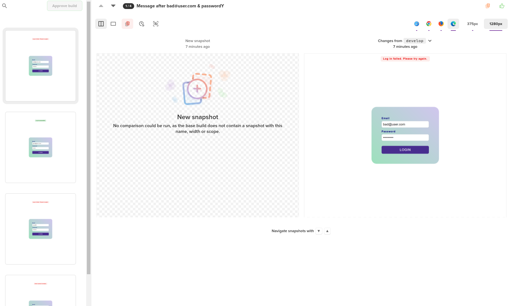
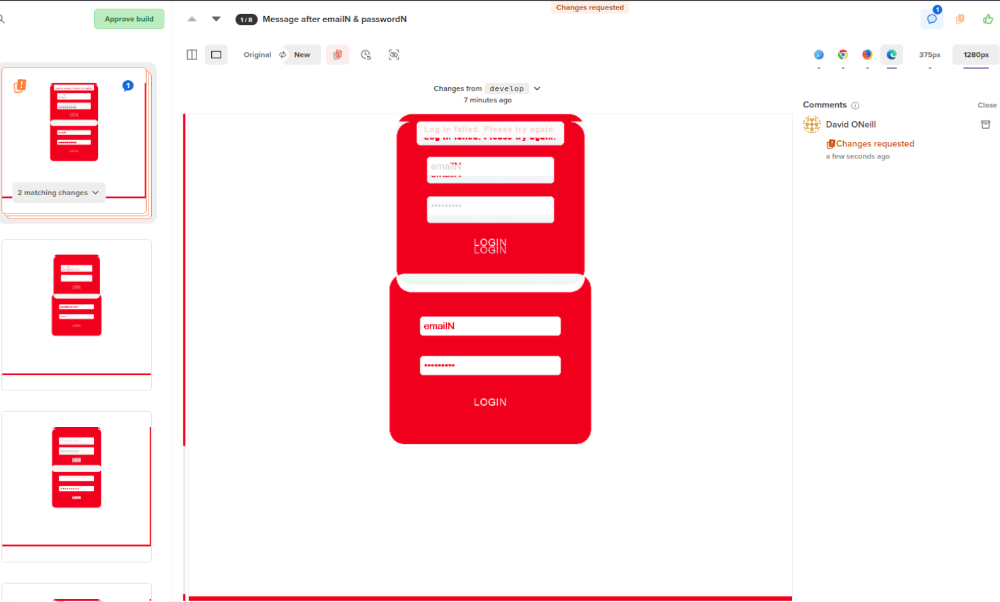

# Visual regression example

Note: this project is based upon End To End Tester and can be thought of as part
2

## What am I promising this time?

A visual testing tool to revolutionise how you test styling and of course, all
from your IDE.

## Setup process

So how do you go about implementing this testing into an existing project?
Assuming you have done everything in part one and are up and running, the only
difference is one extra install into ./tester/
`npm install --save-dev @percy/cli @percy/selenium-webdriver`.

Then you will need to export your percy token: export
PERCY_TOKEN=[your-project-token]

And finally, add an extra script to your `./tester/package.json` with:
`percy exec -- npm test` or whatever your normal local test script is

And now you are ready to use snapshot visual testing!

**Note**: Each snapshot names needs to be unique within a run, and repeatable
for subsequent runs. One strategy, is to just add another step and write it into
the feature. Personally I don't like this as a feature has no place for
non-business actions. Another strategy for a static page load is to just track
if it's the first time. And another strategy is using arguments supplied to
generate the snapshot names.

```js
const { Given } = require("@cucumber/cucumber");
const percySnapshot = require("@percy/selenium-webdriver");

var firstTime = true;

Given(/^I'm on the (.+) page$/, async function (page) {
    await this.driver.get(`http://localhost:3000/${page}`);
    if (firstTime) {
        await percySnapshot(this.driver, `Load ${page}`);
        firstTime = false;
    }
});

When(
    "I attempt to log in using {string} and {string}",
    async function (email, password) {
        await this.driver.findElement(By.id("email")).sendKeys(email);
        await this.driver.findElement(By.id("password")).sendKeys(password);
        await this.driver.findElement(By.css('button[type="submit"]')).click();
        await percySnapshot(this.driver, `Log in with ${email} & ${password}`);
        this.driver.whenLogin = `${email} & ${password}`;
    }
);

Then("I should see a message with {string}", async function (expectedText) {
    const actualDiv = await this.driver.wait(
        until.elementLocated(By.id("user-message")),
        5000
    );
    const actualText = await actualDiv.getText();

    assert.ok(
        actualText.toLowerCase().includes(expectedText.toLowerCase()),
        `Expected ${expectedText} in body`
    );
    await percySnapshot(this.driver, `Message after ${this.driver.whenLogin}`);
});
```

So, I hope can see that there really is very little extra code. Now, what to we
get in return for this little effort? Check out a
[build](https://percy.io/89988188/e2e-tester/builds/26847028).



So now obviously it's super easy to view on all 4 popular browsers on multiple
sizes etc. and approve snapshots. And actually that's already highlighted a
problem with my styling which looks off on Firefox. But the power comes from
when we do a breaking change.

Imagine I break the CSS trying to change from 100vh to 100% to fix the Firefox
issue. Immediately, I can see what's happened:
 Obviously this is an extreme example,
but even subtle changes such as the margin changing slightly show up.

## Purpose

### Nuxt 2 -> 3 regression testing

This tool will come into its own with the jump from Nuxt 2 to Nuxt 3. This can
make sure there's no visual differences between before and after.

### Making big changes in your code

Refactoring a component or changing some infrastructure? Use this to make sure
you've not introduced unwanted style changes somewhere.

### Fixing bugs in CSS

When fixing for one browser, it's easy to break another. This tool negates that
risk somewhat.

## Tips

Don't feel you have to run these all the time. You will know how often to run.
Project milestones or big code changes, rather than after every small change.
